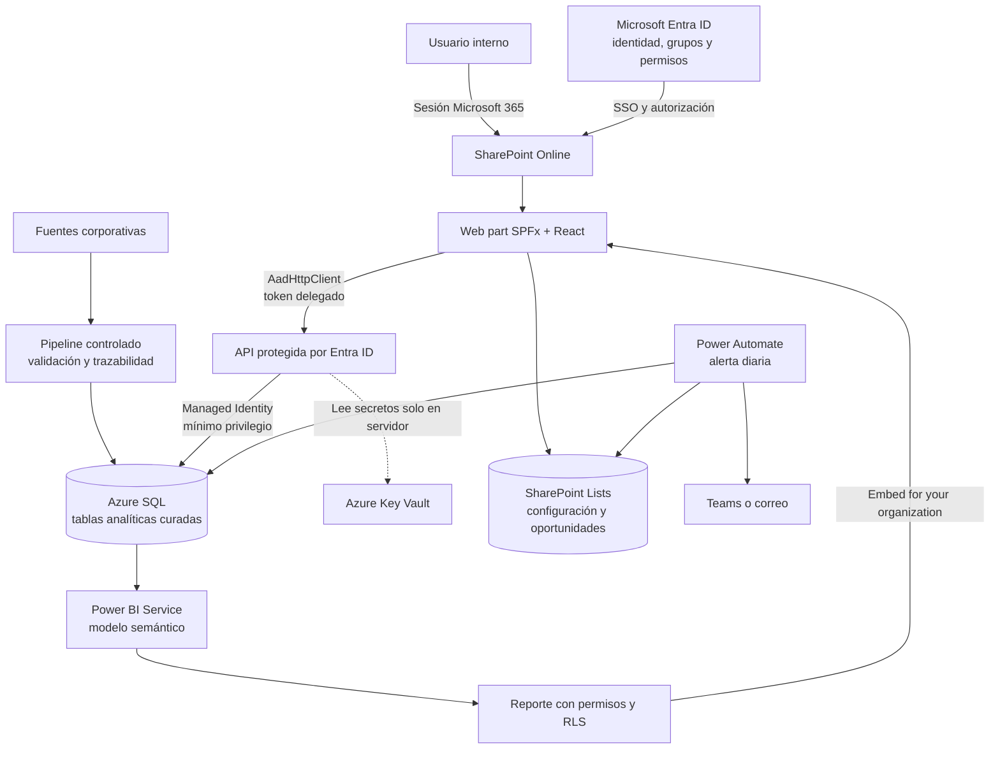

# Arquitectura corporativa propuesta

> Estado: diseño conceptual. Esta fase no crea recursos en Microsoft 365 o Azure ni implementa un proyecto SPFx.

## Objetivo

La aplicación actual demuestra el análisis con archivos estáticos, un login local y un espacio para Power BI. En un entorno corporativo, la misma experiencia podría vivir en SharePoint Online, aprovechar la identidad de Microsoft 365 y consultar datos autorizados sin exponer credenciales en el navegador.

La propuesta responde a tres requisitos: migrar conceptualmente React a SharePoint Framework (SPFx), definir dónde viven datos, parámetros, permisos y secretos, e integrar Power BI con seguridad corporativa.

## Del MVP a la solución corporativa

| Aspecto | MVP actual | Solución corporativa propuesta |
|---|---|---|
| Contenedor | Vite + React independiente | Web part React en SPFx y SharePoint Online |
| Identidad | Login demostrativo y `sessionStorage` | Sesión de Microsoft 365 mediante Microsoft Entra ID |
| Datos | JSON estáticos en `public/data/` | Tablas curadas en Azure SQL, expuestas por una API protegida |
| Configuración | Variables `VITE_*` visibles en el cliente | Propiedades no secretas del web part y configuración autorizada |
| Secretos | No se utilizan | Azure Key Vault; nunca el frontend, listas o repositorio |
| Power BI | `iframe` demostrativo | Power BI Service con permisos del usuario y RLS |
| Operación | Exploración manual | Seguimiento en SharePoint Lists y alerta diaria con Power Automate |

## Vista general



El navegador no se conecta directamente a Azure SQL ni recibe credenciales de base de datos. La API valida identidad y autorización en cada solicitud antes de consultar los datos permitidos.

## Responsabilidades

| Componente | Responsabilidad | Qué no debe hacer |
|---|---|---|
| Azure SQL | Almacenar clientes, productos y consumos curados; ofrecer vistas autorizadas | Guardar secretos o lógica de presentación |
| Pipeline controlado | Ingerir, limpiar, validar y publicar con trazabilidad | Publicar datos sin controles de calidad |
| SharePoint Lists | Configuración pequeña, asignaciones y oportunidades | Replicar el dataset analítico completo |
| Microsoft Entra ID | Autenticar usuarios, administrar grupos y consentimientos | Reemplazar la autorización de API o RLS |
| API protegida | Autorizar solicitudes y entregar los datos mínimos | Confiar únicamente en controles del frontend |
| Key Vault | Custodiar secretos, certificados o claves del backend | Entregar secretos al navegador |
| Managed Identity | Autorizar acceso entre servicios sin credenciales incrustadas | Conceder privilegios innecesarios |
| Power BI Service | Modelo semántico, reporte, permisos y RLS | Conceder acceso por conocer una URL o ID |
| SPFx | Presentar el dashboard en el contexto de SharePoint | Implementar otro login o guardar tokens duraderos |
| Power Automate | Detectar vencimientos, mantener oportunidades y notificar una vez | Duplicar la analítica completa en listas |

## Cómo viaja una solicitud

1. El usuario inicia sesión en Microsoft 365 y abre SharePoint.
2. SharePoint carga `DigotecAnalyticsWebPart` con el contexto del usuario.
3. El web part pide datos mediante `IDataService`; no conoce Azure SQL directamente.
4. `IDataService` usa `AadHttpClient` para obtener un token delegado y llamar a la API registrada en Entra ID.
5. La API valida audiencia, emisor, vigencia y permisos; aplica autorización y consulta Azure SQL mediante Managed Identity.
6. La API devuelve solo campos y filas autorizados. React renderiza filtros, KPIs y estados.
7. Para Power BI, el servicio obtiene la configuración autorizada y el reporte respeta permisos y RLS.

Autenticarse responde **quién es el usuario**. Autorizar responde **qué puede ver o hacer**. Microsoft 365 resuelve la primera pregunta; la API, grupos, permisos y RLS resuelven la segunda.

## Adaptación de React a SPFx

SPFx admite React y se ejecuta en el contexto del usuario autenticado. La aplicación actual usa React 19 y Vite, por lo que no se copiará literalmente. Antes de una migración real se comprobará la [matriz oficial de compatibilidad de SPFx](https://learn.microsoft.com/en-us/sharepoint/dev/spfx/compatibility) y se elegirá una combinación estable de Node, React y TypeScript.

### Contrato conceptual

```ts
interface IDataService {
  getDashboard(filters: DashboardFilters): Promise<DashboardData>
  getClients(filters: DashboardFilters, page: number): Promise<PagedClients>
}

interface IPowerBIService {
  getAuthorizedReport(): Promise<PowerBIReportDescriptor>
}

interface PowerBIReportDescriptor {
  tenantId: string
  workspaceId: string
  reportId: string
  embedUrl: string
}
```

- `DigotecAnalyticsWebPart` recibe el contexto de SharePoint y propiedades no secretas.
- `IDataService` abstrae clientes y métricas.
- `IPowerBIService` obtiene la configuración de un reporte autorizado.
- Los componentes visuales reciben datos mediante `props`; no consultan SharePoint o SQL directamente.
- `AadHttpClient` llama a la API protegida. Los permisos requieren aprobación administrativa en SharePoint.

### Reutilización y reemplazo

| Se reutiliza conceptualmente | Se reemplaza |
|---|---|
| Filtros, KPIs, oportunidades y vista de clientes | Scaffold y servidor de Vite |
| Tipos TypeScript y lógica pura de métricas | Login demostrativo y `sessionStorage` |
| Estilos, accesibilidad y diseño responsive | `fetch` directo a JSON en `public/data/` |
| Estados de carga, error, reintento y sin resultados | Variables `VITE_*` como configuración corporativa |
| Pruebas adaptables | Toolchain incompatible con la versión estable de SPFx |

La separación por servicios conserva la experiencia visual aunque cambie la infraestructura. Las API protegidas seguirían el patrón oficial de [`AadHttpClient`](https://learn.microsoft.com/es-es/sharepoint/dev/spfx/use-aadhttpclient).

## Integración segura de Power BI

### Recomendación para usuarios internos

Se propone **embed for your organization** (*user owns data*):

- el usuario usa su identidad corporativa;
- el acceso depende de sus permisos en Power BI y Entra ID;
- RLS limita filas dentro del modelo semántico;
- el token se obtiene en ejecución y permanece solo en memoria durante su vigencia;
- conocer `embedUrl` o `reportId` no concede acceso.

RLS complementa, pero no reemplaza, la autorización de la API ni los permisos del workspace.

### Evolución opcional: app owns data

Si en el futuro se requiere *app owns data*, un backend autorizado generará tokens de embed temporales. El secreto o certificado de la aplicación permanecerá en Key Vault y nunca llegará al navegador. Los tokens tienen duración limitada y pueden transportar una identidad efectiva para RLS.

| Elemento | Clasificación | Ubicación recomendada |
|---|---|---|
| `tenantId`, `workspaceId`, `reportId`, `embedUrl` | Identificadores internos, no secretos | Propiedades del web part o servicio autorizado |
| Token OAuth o de embed | Credencial temporal | Memoria durante su vigencia; emitido por una identidad autorizada |
| Secreto de aplicación, certificado o credencial SQL | Secreto | Key Vault; consumo exclusivo del backend o servicio |

El `iframe` del MVP solo demuestra la ubicación y el estado de configuración. No constituye una integración corporativa. Referencias: [tokens de embed](https://learn.microsoft.com/en-us/power-bi/developer/embedded/generate-embed-token) y [seguridad de Power BI](https://learn.microsoft.com/en-us/fabric/security/power-bi-security).

## Clasificación de información

| Nivel | Ejemplos | Tratamiento mínimo |
|---|---|---|
| Pública | Nombre del producto y documentación sin datos de clientes | Publicación tras revisión |
| Interna | Arquitectura, IDs de tenant/workspace/reporte, configuración no sensible | Acceso a colaboradores autorizados |
| Confidencial | Clientes, saldos, consumos, asignaciones y oportunidades | Acceso por rol, cifrado, auditoría y minimización |
| Secreta | Secretos, certificados, claves SQL y tokens | Key Vault, rotación y nunca repositorio, listas o frontend |

## Matriz de permisos propuesta

| Actor | Dashboard | Datos/API | Power BI | Listas operativas | Administración |
|---|---|---|---|---|---|
| Analista | Lectura | Cartera autorizada | Lectura con RLS | Oportunidades asignadas | Ninguna |
| Responsable comercial | Lectura | Clientes asignados | Lectura con RLS | Leer y actualizar sus oportunidades | Ninguna |
| Administrador funcional | Lectura | Lectura controlada | Administrar audiencia y revisar RLS | Mantener asignaciones y estados | Sin secretos |
| Identidad del flujo | Sin interfaz | Leer vista de vencimientos | Sin acceso salvo necesidad | Leer asignaciones y crear/actualizar oportunidades | Solo conexiones requeridas |
| Administrador técnico | Soporte restringido | Configuración y auditoría | Administración técnica | Administración técnica | Despliegue, identidades y Key Vault con roles separados |

Los permisos se asignan preferentemente a grupos y siguen mínimo privilegio. Las funciones administrativas se separan cuando sea posible.

## Controles mínimos

- HTTPS y validación estricta de URLs de embed.
- Ningún secreto o token persistente en React, SPFx, `VITE_*`, Lists o Git.
- Tokens breves, alcance mínimo y validación en servidor.
- Autorización en cada endpoint; ocultar un botón no controla acceso.
- RLS probado con usuarios representativos antes de publicar.
- Datos mínimos en respuestas, Teams y correo.
- Logs sin tokens ni información sensible innecesaria.
- Managed Identity y referencias de conexión administradas cuando sea posible.
- Políticas DLP para bloquear conectores no aprobados.
- Revisión de compatibilidad, dependencias y permisos al actualizar SPFx.

## Camino futuro

1. Validar responsables, grupos, licencias y clasificación de datos.
2. Publicar las tablas mediante un pipeline y vistas de mínimo privilegio.
3. Registrar y proteger la API; aprobar permisos administrativos.
4. Crear SPFx con la matriz estable y migrar primero componentes sin datos.
5. Implementar servicios de datos y Power BI; probar denegaciones y RLS.
6. Crear listas y el flujo descrito en [AUTOMATION.md](./AUTOMATION.md).
7. Ejecutar un piloto con observabilidad y plan de reversión.

## Referencias oficiales

- [Introducción a SharePoint Framework](https://learn.microsoft.com/en-us/sharepoint/dev/spfx/sharepoint-framework-overview)
- [Compatibilidad de SPFx](https://learn.microsoft.com/en-us/sharepoint/dev/spfx/compatibility)
- [API protegida con AadHttpClient](https://learn.microsoft.com/es-es/sharepoint/dev/spfx/use-aadhttpclient)
- [Tokens de embed de Power BI](https://learn.microsoft.com/en-us/power-bi/developer/embedded/generate-embed-token)
- [Seguridad de Power BI](https://learn.microsoft.com/en-us/fabric/security/power-bi-security)
