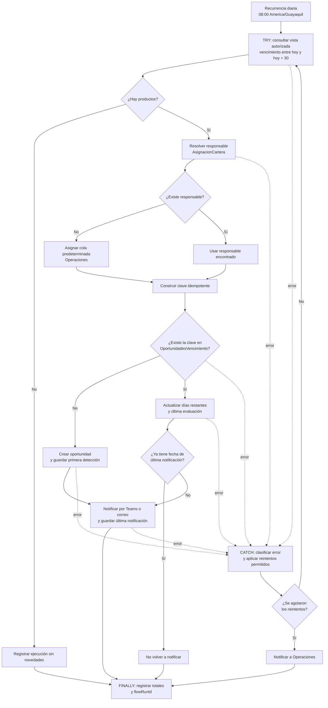

# Automatización propuesta de vencimientos

> Estado: especificación funcional y técnica. No se creó un flujo real, listas de SharePoint ni conexiones en Microsoft 365.

## Objetivo y valor

El flujo `DIGOTEC - Alertas de vencimiento a 30 días` identifica diariamente productos próximos a vencer, crea o actualiza una oportunidad para el responsable y notifica solo la primera vez que se detecta cada vencimiento.

El valor no está en enviar más correos, sino en convertir una señal analítica en una tarea trazable sin producir alertas duplicadas.

## Flujo diario



### Secuencia

1. Ejecutar a las 08:00 en `America/Guayaquil`.
2. Consultar una vista autorizada de Azure SQL con productos activos cuyo vencimiento esté entre la fecha local de ejecución y los siguientes 30 días, ambas incluidas.
3. Buscar responsable en `AsignacionCartera`, primero por segmento y ciudad y luego por una asignación general del segmento.
4. Si no hay coincidencia, usar la cola predeterminada de Operaciones.
5. Construir `cliente_producto_id|fecha_vencimiento`.
6. Buscar la clave en `OportunidadesVencimiento`.
7. Si no existe, crear, guardar primera detección, notificar y registrar la notificación.
8. Si existe, actualizar días restantes y última evaluación. Si ya tiene una notificación exitosa, no renotificar; si quedó sin notificar por una falla previa, reintentar de forma controlada.
9. Registrar la ejecución, incluso sin novedades o con error.

En producción, “hoy” corresponde a cada ejecución. La fecha de corte `31/08/2026` solo reproduce el ejercicio y no congela el flujo futuro.

## Fuente autorizada

La vista de Azure SQL expondría únicamente:

| Campo | Uso |
|---|---|
| `cliente_producto_id` | Identificador estable de cliente-producto |
| `cliente_id` | Referencia del cliente |
| `producto` | Producto próximo a vencer |
| `fecha_vencimiento` | Fecha contractual |
| `dias_para_vencer` | Priorización operativa |
| `segmento_cliente` | Asignación de cartera |
| `ciudad` | Asignación opcional |

La identidad del flujo tendría lectura solo sobre esta vista, no toda la base. El filtro se ejecutaría en SQL para evitar trasladar registros innecesarios.

## Listas operativas

### `AsignacionCartera`

| Campo | Tipo sugerido | Regla |
|---|---|---|
| `clave_asignacion` | Texto | Única; `segmento|ciudad` o `segmento|*` |
| `segmento` | Opción | Obligatorio |
| `ciudad` | Texto | Opcional; vacío equivale a asignación general |
| `responsable` | Persona o grupo | Obligatorio |
| `correo_responsable` | Texto | Validado; usado en la notificación |
| `activo` | Sí/No | Solo filas activas participan |

Prioridad: coincidencia `segmento + ciudad`, luego `segmento + *` y, finalmente, Operaciones.

### `OportunidadesVencimiento`

| Campo | Tipo sugerido | Regla |
|---|---|---|
| `clave_oportunidad` | Texto | Única; `cliente_producto_id|fecha_vencimiento` |
| `cliente_id` | Texto | Obligatorio |
| `cliente_producto_id` | Texto | Obligatorio |
| `producto` | Opción o texto | Obligatorio |
| `fecha_vencimiento` | Fecha | Obligatorio |
| `dias_restantes` | Entero | Se actualiza diariamente |
| `responsable` | Persona o grupo | Responsable o cola predeterminada |
| `estado` | Opción | `Nueva`, `Notificada`, `En gestión`, `Renovada` o `Cerrada sin renovación` |
| `primera_deteccion` | Fecha y hora | Solo al crear |
| `ultima_evaluacion` | Fecha y hora | En cada detección |
| `ultima_notificacion` | Fecha y hora | Solo tras notificar correctamente |
| `ultimo_flow_run_id` | Texto | Trazabilidad de la actualización |

`clave_oportunidad` debe exigir valores únicos. El bucle tendrá concurrencia controlada para evitar creaciones simultáneas.

Las listas guardan configuración y seguimiento, no una copia del dataset analítico.

### Registro técnico

Power Automate mantiene su historial nativo. Para seguimiento prolongado se recomienda un destino administrado —por ejemplo, una lista técnica restringida `EjecucionesAutomatizacion` o la plataforma de observabilidad aprobada— con:

- `flowRunId`, fecha, estado y duración;
- cantidades consultada, creada, actualizada, notificada y omitida;
- código y resumen sanitizado del error final.

No contendrá tokens, credenciales ni detalle financiero del cliente.

## Idempotencia

Idempotencia significa que repetir una operación deja el mismo resultado de negocio. Por ejemplo:

```text
C000123-TARJETA|2026-09-30
```

La primera ejecución crea y notifica. Las siguientes encuentran la clave, actualizan los campos variables y no crean ni notifican de nuevo.

Controles necesarios:

- identificador estable, no índice de fila;
- columna única en SharePoint;
- búsqueda antes de crear;
- concurrencia controlada;
- fecha de notificación solo tras un envío exitoso;
- un registro existente sin fecha de notificación puede completar ese paso tras una falla parcial;
- al reanudar, consultar el estado en vez de suponer que toda la operación falló.

Si una renovación cambia realmente el vencimiento, la nueva fecha genera otra clave y permite una oportunidad legítima.

## Manejo de errores

Las acciones se agrupan en `TRY`, `CATCH` y `FINALLY` mediante **Configurar ejecución posterior** (*Configure run after*).

### TRY

- consulta SQL;
- resolución del responsable;
- creación o actualización;
- notificación;
- acumulación de contadores.

### CATCH

- capturar `flowRunId`, acción fallida y mensaje sanitizado;
- aplicar reintentos exponenciales solo a errores transitorios como `429`, `5xx` o timeout;
- no reintentar indefinidamente errores de permisos, configuración o datos;
- avisar a Operaciones solo al agotar los reintentos.

Como punto inicial se proponen hasta tres reintentos exponenciales, ajustables a los límites reales.

### FINALLY

- registrar estado, duración y contadores;
- guardar el error final si existe;
- dejar la siguiente ejecución capaz de continuar con las mismas claves.

Microsoft describe estos patrones en su guía de [manejo de errores](https://learn.microsoft.com/en-us/power-automate/guidance/coding-guidelines/error-handling).

## Notificación

Teams o correo incluiría solo:

- referencia permitida del cliente;
- producto, fecha y días restantes;
- responsable;
- enlace a la oportunidad autorizada.

No se incluyen saldos o consumos si no son necesarios para gestionar el vencimiento.

## Seguridad y gobierno

- Cuenta de servicio controlada o referencias de conexión administradas, no conexiones personales.
- Lectura de la vista SQL y permisos mínimos sobre las listas.
- Separación entre administración funcional, conexiones y secretos.
- Políticas DLP para impedir conectores no aprobados.
- Ningún token, secreto o cadena de conexión en acciones, variables, mensajes o logs.
- Verificar licencias del conector de Azure SQL antes de implementar.
- Mantener propietario secundario y procedimiento de continuidad.
- Revisar responsables inactivos, accesos y oportunidades abiertas.

Referencias oficiales: [flujos programados](https://learn.microsoft.com/en-us/power-automate/run-scheduled-tasks) e [integración con SharePoint](https://learn.microsoft.com/en-us/power-automate/sharepoint-overview).

## KPIs propuestos

| KPI | Definición | Uso |
|---|---|---|
| Tasa de ejecuciones exitosas | Exitosas / programadas | Confiabilidad |
| Oportunidades nuevas | Registros creados | Trabajo generado |
| Notificaciones enviadas | Avisos exitosos | Cobertura inicial |
| Duplicados creados | Claves repetidas | Idempotencia; objetivo cero |
| Renovaciones antes del vencimiento | Renovadas a tiempo / elegibles | Resultado a observar, sin atribuir causalidad automática |
| Tiempo promedio de gestión | Primera detección a cierre | Eficiencia |
| Porcentaje sin responsable | Asignadas a Operaciones / elegibles | Calidad de asignaciones |

No se inventan metas comerciales: primero se necesita una línea base real.

## Pruebas antes de activarlo

| Caso | Resultado esperado |
|---|---|
| Sin productos elegibles | Éxito con cero creados y notificados |
| Producto nuevo | Una oportunidad y una notificación |
| Mismo producto al día siguiente | Actualización sin duplicado ni aviso |
| Dos ramas reciben la misma clave | Restricción única impide duplicado |
| Sin responsable | Asignación a Operaciones y registro |
| Error SQL transitorio | Reintentos; alerta solo si se agotan |
| Error permanente de permiso | Falla controlada, sin bucle infinito |
| Ejecución cerca de medianoche | Fecha correcta en `America/Guayaquil` |
| Acceso a cartera no autorizada | Solicitud rechazada |
| Reanudación tras falla parcial | Consulta las claves y no duplica |

## Límites

- No se creó el flujo, listas, vista SQL, conexiones ni cuentas.
- Los nombres y campos requieren aprobación funcional y técnica.
- El dataset sintético demuestra la oportunidad, pero no una operación real.
